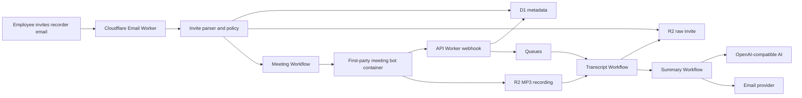

# Architecture

minutesbot is the Cloudflare control plane and includes its own Cloudflare Container meeting bot runtime. The bot runtime is first-party TypeScript code in this repository.

## Data Flow

1. Email Worker receives the Teams invite addressed to the configured recorder email.
2. The invite parser extracts UID, METHOD, subject, organizer, attendees, times, and Teams URL.
3. Recipient policy marks eligible same-company attendees and excludes external recipients by default.
4. D1 stores meeting metadata, attendees, webhook events, email deliveries, summaries metadata, and audit logs.
5. R2 stores raw invites, bot-uploaded MP3 recordings, transcript JSON/text, summaries, and artifacts.
6. Workflow creates a meeting bot before start time and supplies bot-level webhooks plus MP3 recording storage settings.
7. The bot runtime posts managed webhook events to `/api/webhooks/bot`.
8. After post-processing completes, Transcript workflow reads `recordings/<meetingId>/recording.mp3` from R2, transcribes it with the OpenRouter/Whisper provider, stores transcript artifacts, and queues summarization.
9. Summary workflow generates notes, filters recipients, and sends only eligible same-company attendees.

## Failure States

Rejected invites are stored in audit logs with explicit statuses: wrong recorder, external organizer, no Teams URL, parse error, or no eligible recipients. Bot, transcript, summary, and email failures are reflected on meeting detail pages and can be retried.
