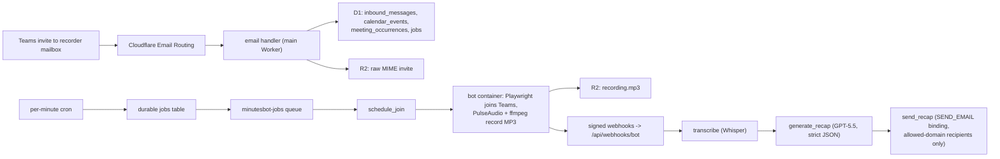

# Architecture

minutesbot is a self-hosted, single-tenant Microsoft Teams meeting notetaker that runs entirely on Cloudflare. Two deployable units make up the system:

1. **The main Worker** (`wrangler.jsonc` at the repo root, entry `apps/api-worker/src/index.ts`). One Worker exports every control-plane handler:
   - `fetch`: Hono admin API under `/api/*` plus the React admin SPA served from Workers Static Assets (`ASSETS` binding, `apps/web/dist`).
   - `email`: the inbound Email Worker handler (`apps/email-worker`) that receives Teams invites addressed to the recorder mailbox via Cloudflare Email Routing.
   - `queue`: the consumer for the `minutesbot-jobs` queue (dead-letter queue `minutesbot-dlq`).
   - `scheduled`: two crons — `* * * * *` (durable job sweep + stale bot session recovery) and `0 3 * * *` (recurrence window expansion + retention cleanup).
   - Bindings: D1 `DB` (database `minutesbot`), R2 `ARTIFACTS` (bucket `minutesbot-artifacts`), queue producer + consumer `JOBS_QUEUE`, `SEND_EMAIL` (Email Workers send binding), `ASSETS`.
2. **The bot runtime** (`minutesbot-meeting-bot` worker in `deploy/bot-container`, deployed by `pnpm bot:deploy`). A Cloudflare Container hosts `apps/bot-runtime`: a Node/Hono service that drives a Playwright Chromium guest join into Teams, records meeting audio with PulseAudio + ffmpeg into MP3, uploads recordings to R2 through the worker's `/internal/recordings` endpoint, and reports state over signed webhooks. See [meeting-bot-runtime.md](meeting-bot-runtime.md).



## Data model

`migrations/0009_occurrence_overhaul.sql` defines the occurrence-based model:

```text
inbound_messages -> calendar_events -> meeting_occurrences -> bot_sessions
                                            |                     |
                                            +-> transcripts       +-> bot_events
                                            +-> recaps -> email_deliveries
jobs (durable scheduler), attendees, allowed_domains, artifacts, audit_logs
```

- **inbound_messages** — every email the recorder mailbox receives, accepted or not. Deduplicated by raw content hash (unique index) and Message-ID; the raw MIME body lives in R2 (`raw_r2_key`), never in D1.
- **calendar_events** — one row per ICS UID: a one-off meeting or a recurring series (with `rrule`, `rdates`, `exdates`, `is_recurring`, `expanded_until`).
- **meeting_occurrences** — one row per concrete occurrence. `occurrence_key` is the original scheduled start in UTC basic format (ICS RECURRENCE-ID semantics); overrides set `is_override` and may carry their own subject/URL/times/attendees.
- **attendees** — attached to the series; an occurrence override carries its own list via `occurrence_id`. Each row records `is_external`, `recipient_eligible`, and `exclusion_reason`.
- **bot_sessions** — one row per bot runtime session. An occurrence may accumulate several after retries, but a partial unique index allows at most one active session.
- **bot_events** — webhook events from the runtime, deduplicated by `idempotency_key`; oversized payloads go to R2.
- **transcripts / recaps** — per-occurrence state rows; transcript and recap bodies live in R2 via **artifacts** (owner-scoped R2 pointers — D1 never stores artifact bytes).
- **email_deliveries** — one row per recipient per recap (unique on `recap_id, recipient_email`); retries reuse the row.
- **jobs** — durable job records, the single source of truth for scheduled and async work. Queue messages are only delivery hints; the per-minute cron sweeps due jobs whose message was lost or whose lease expired.
- **allowed_domains** — the recap-delivery allowlist, mirrored from settings on save so the send boundary enforces policy with one indexed lookup.
- **audit_logs** — typed audit events (see `auditEventTypes` in `packages/shared/src/status.ts`) with severity.

## State machines

All states live in `packages/shared/src/status.ts`; every async step persists a status so the admin UI and retry tooling can always tell where an item stopped.

### Occurrence lifecycle

```text
scheduled -> join_queued -> in_meeting -> post_meeting -> transcribing
  -> summarizing -> sending_recap -> completed
                                  -> completed_no_eligible_recipients
any state -> failed | canceled | skipped (terminal)
```

`completed_no_eligible_recipients` is a successful terminal state: the pipeline ran but no attendee belonged to an allowed domain, so no recap email was sent (policy, not an error).

### Bot session states

Emitted over signed webhooks by the runtime:

```text
created -> warming -> browser_starting -> prejoin
  -> waiting_for_start | waiting_room -> joined -> recording
  -> stopping -> uploading -> post_processing_completed
any state -> failed | canceled (terminal)
```

### Jobs

Job types: `schedule_join`, `monitor_bot`, `cancel_bot`, `transcribe`, `generate_recap`, `send_recap`, `expand_recurrences`, `retention_cleanup`.

Job statuses: `pending -> leased -> completed`, with `failed_retryable` (will be retried until `max_attempts`), `failed_terminal` (conclusively non-retryable), `dead_letter` (retries exhausted), and `canceled`.

Transcript/recap statuses: `pending | running | completed | failed_retryable | failed_terminal`. Delivery statuses: `pending | sent | failed | skipped_policy`.

## Recurrence handling

- `packages/invite-parser` parses MIME + ICS including `RRULE`, `RDATE`, `EXDATE`, and `RECURRENCE-ID`.
- `packages/recurrence` expands a series into concrete occurrences inside a rolling window (`scheduling.recurrenceExpansionDays`, default **180 days**). The daily `expand_recurrences` job advances the window (`calendar_events.expanded_until`).
- A `METHOD:REQUEST` with a `RECURRENCE-ID` updates a single occurrence as an **override** (its own subject/time/URL/attendees) without touching the rest of the series.
- A `METHOD:CANCEL` with a `RECURRENCE-ID` cancels one occurrence and records it as an `EXDATE` on the series; a series-level cancel marks the event `canceled` and cancels future occurrences.
- ICS `SEQUENCE` ordering rejects stale updates.

## Pipeline (jobs)

1. **Ingest** (email handler): dedupe, store raw MIME in R2, verify sender authentication (SPF/DKIM/DMARC via Authentication-Results when `policy.requireAuthenticatedSender`), apply policy (recorder address match, external-organizer rejection, Teams URL required), upsert the event, expand occurrences, create `schedule_join` jobs at `start - bot.joinLeadMinutes`.
2. **schedule_join**: creates a `bot_sessions` row and calls the bot runtime (`POST /v1/bots` with meeting URL, display name, timeouts, webhook URL + token, R2 upload target). `monitor_bot` watches heartbeats; `maxJoinAttempts` bounds retries.
3. **transcribe**: reads the MP3 from R2 and calls OpenAI Whisper (`whisper-1` default) or any whisper-compatible endpoint (`packages/transcription`); stores transcript JSON/text as artifacts.
4. **generate_recap**: calls an OpenAI-compatible chat API (default model `gpt-5.5`) requesting strict JSON, validates with zod, and retries once with a repair prompt on schema failure (`packages/summary-engine`).
5. **send_recap**: renders the email (`packages/email-renderer`) and sends through the `SEND_EMAIL` binding (`packages/email-sender`). Recipients are filtered to admin-allowed domains only — external attendees never receive recaps. Zero eligible recipients ends the occurrence as `completed_no_eligible_recipients`.
6. **Maintenance** (daily cron): `expand_recurrences` and `retention_cleanup` (per-type retention windows from settings; R2 objects deleted, artifact rows tombstoned).

## Packages

| Package | Responsibility |
| --- | --- |
| `packages/shared` | Settings schema (zod), statuses, ids, dates, errors, webhook signing helpers |
| `packages/db` | D1 query helpers for every table |
| `packages/invite-parser` | MIME + ICS parsing (RRULE/EXDATE/RECURRENCE-ID), Teams URL extraction |
| `packages/recurrence` | RRULE expansion into the rolling occurrence window |
| `packages/scheduler` | Invite ingestion into events/occurrences/jobs |
| `packages/recipient-policy` | Allowed-domain matching (exact by default, optional subdomains) |
| `packages/bot-client` | Typed fetch client + webhook payload schema for the bot runtime |
| `packages/transcription` | Whisper / whisper-compatible transcription client |
| `packages/summary-engine` | GPT recap generation with strict zod-validated JSON + repair retry |
| `packages/email-renderer` / `packages/email-sender` | Recap rendering and policy-enforced delivery |

Failures at every stage are persisted with explicit statuses and surfaced on the occurrence detail page with retry actions — see [operations.md](operations.md) and [troubleshooting.md](troubleshooting.md).
